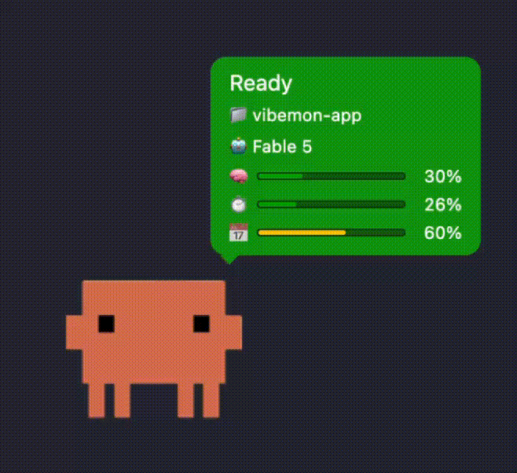

# VibeMon

[](https://www.npmjs.com/package/vibemon)
[](https://www.npmjs.com/package/vibemon)
[](https://github.com/opspresso/vibemon-app/blob/main/LICENSE)

**Real-time status monitor for AI assistants with pixel art character display.**

See at a glance what your AI assistant is doing — thinking, working, or waiting for input. A cute pixel art character visually represents the current state.

Desktop (Electron) app for VibeMon. For the ESP32 hardware display, see [vibemon-esp32](https://github.com/opspresso/vibemon-esp32).

## Supported Tools

| Tool | Description |
|------|-------------|
| **[Claude Code](https://claude.ai/code)** | Anthropic's official AI coding assistant |
| **[Codex](https://openai.com/codex)** | OpenAI's AI coding agent |
| **[Kiro](https://kiro.dev/)** | AWS's AI coding assistant |
| **[OpenClaw](https://openclaw.ai/)** | Open-source computer use agent |

## Agent Integration Model

VibeMon does not talk to agent runtimes directly. Each supported agent is bridged into the same status payload and then rendered by the Desktop App (or the [ESP32 display](https://github.com/opspresso/vibemon-esp32)).

| Agent | Bridge type | Tool visibility | Notes |
|------|-------------|-----------------|-------|
| Claude Code | Native hooks | Broad | Best documented lifecycle and tool coverage |
| Codex | Native hooks + `codex exec --json` | Partial in interactive mode, broad in automation | Interactive hooks are experimental and currently Bash-focused |
| Kiro | Native hooks | Broad | Good tool-level hooks with MCP-aware tool names |
| OpenClaw | Plugin bridge | Plugin-dependent | Uses plugin SDK hooks rather than the simpler internal hook system |

### Support Quality

- **Claude Code**: Richest hook surface. Best fit for real-time state, permissions, compacting, and subagent-aware monitoring.
- **Codex**: Strong support, but split by mode. Interactive sessions expose limited tool hooks today, while `codex exec --json` is better for CI and automation.
- **Kiro**: Clean hook model for prompt, tool, and stop events. Practical fit for real-time monitoring.
- **OpenClaw**: Best supported through plugins. Internal hooks are session/message oriented, so plugin SDK integration is the right path for VibeMon.

## What It Monitors

| Field | Description | Example |
|-------|-------------|---------|
| **State** | Current activity state | `working`, `idle`, `notification` |
| **Project** | Active project directory | `vibemon-app` |
| **Tool** | Currently executing tool | `Bash`, `Read`, `Edit` |
| **Model** | Active model | `Opus`, `Sonnet` |
| **Memory** | Context window usage | `45%` |

## Quick Start

Homebrew (macOS, recommended):

```bash
brew tap opspresso/tap
brew install opspresso/tap/vibemon
```

Or via npm:

```bash
npx vibemon
```

That's it! The app launches in the system tray and listens on `http://127.0.0.1:19280`.

`vibemon --version` prints the installed version, `vibemon --help` prints usage — both exit without launching the app.

Open **Settings > AI Tools** from the tray menu and click **Install** for Claude Code, Codex CLI, Kiro IDE, or OpenClaw — this sets up the hooks and collector config for you, no separate installer needed. See [Settings Window](docs/features.md#settings-window) for details.

## Preview



## Documentation

- [Features](docs/features.md) - States, animations, character window behavior
- [API Reference](docs/api.md) - Complete HTTP API documentation

For full documentation, visit **[vibemon.io/docs](https://vibemon.io/docs)**.

## States

| State | Color | Description |
|-------|-------|-------------|
| `start` | Cyan | Session begins |
| `idle` | Green | Waiting for input |
| `thinking` | Purple | Processing prompt |
| `planning` | Teal | Plan mode active |
| `working` | Blue | Tool executing |
| `packing` | Gray | Context compacting |
| `notification` | Yellow | User input needed |
| `done` | Green | Tool completed |
| `sleep` | Navy | After 5min in idle |
| `alert` | Red | Critical error/failure |

See [Features](docs/features.md) for animations, working state text, and more.

## Characters

| Character | Color | Auto-selected for |
|-----------|-------|-------------------|
| `vibemon` | Purple | Default; any bridge without its own character |
| `clawd` | Orange | Claude Code |
| `codex` | Navy | Codex CLI |
| `kiro` | White | Kiro |
| `claw` | Red | OpenClaw |
| `daangni` | Peach/teal | Manual only (Character Lock) |

> The **Color** column is each character's overall look. This is distinct from the per-character `color` in the registry, which sets the eye/accent overlay drawn on the sprite — white for VibeMon, whose face is white.

### Character Lock

Force the character to always be one of the above, regardless of what each project's status reports. Default is `auto` (each project shows its own character).

```bash
curl -X POST http://127.0.0.1:19280/character-lock \
  -H "Content-Type: application/json" \
  -d '{"character":"daangni"}'
```

Switch via system tray menu (**Character Lock** submenu) or the API above.

## HTTP API

Default port: `19280`

### POST /status

Update monitor status:

```bash
curl -X POST http://127.0.0.1:19280/status \
  -H "Content-Type: application/json" \
  -d '{"state":"working","tool":"Bash","project":"my-project"}'
```

### GET /status

Get every tracked project's status and which one the character follows:

```bash
curl http://127.0.0.1:19280/status
```

### POST /quit

Stop the application:

```bash
curl -X POST http://127.0.0.1:19280/quit
```

See [API Reference](docs/api.md) for all endpoints.

## Character Window

One persistent character + following speech bubble, tracking whichever project is active:

- A project in an active state (thinking, working, notification, ...) takes focus; otherwise the most recently updated project keeps it
- Updates from other projects are still collected in the background and shown the moment they gain focus
- Drag it anywhere; it remembers its spot across restarts

See [Features](docs/features.md) for details.

## Troubleshooting

| Issue | Solution |
|-------|----------|
| Window not appearing | Check system tray, or run `curl -X POST http://127.0.0.1:19280/show` |
| Port already in use | Check with `lsof -i :19280` |
| Hook not working | Verify Python 3: `python3 --version` |

See [Features](docs/features.md) for desktop app details.

## Related Projects

- [vibemon-esp32](https://github.com/opspresso/vibemon-esp32) - ESP32 hardware display firmware
- [vibemon](https://github.com/opspresso/vibemon) - Cloud dashboard & API ([vibemon.io](https://vibemon.io))
- [vibemon-docs](https://github.com/opspresso/vibemon-docs) - Agent hook installation & setup guide ([vibemon.io/docs](https://vibemon.io/docs))

## License

MIT
