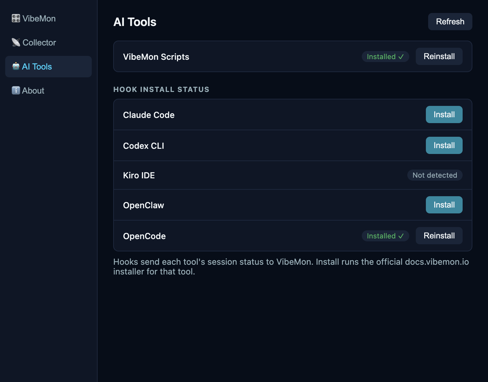

# Features

## Agent Support

VibeMon normalizes multiple agent ecosystems into one display model. The rendering layer is shared, but the integration path is not.

| Agent | Integration path | Best signal source | Observability quality | Important limitation |
|------|-------------------|--------------------|-----------------------|----------------------|
| Claude Code | Native hooks | Session, turn, and tool hooks | High | None significant for basic monitoring |
| Codex | Native hooks and non-interactive JSON output | Interactive lifecycle and local tool hooks, `codex exec --json` for automation | High | Hosted tools such as WebSearch do not pass through local tool hooks |
| Kiro | Native hooks | Prompt, tool, and stop hooks | High | Fewer lifecycle events than Claude Code |
| OpenClaw | Plugin bridge | Plugin SDK hooks | Medium to high | Internal hooks are not enough by themselves for full tool-loop visibility |
| OpenCode | Plugin + Python adapter | Session, chat, tool, permission, and compaction events | High | No context or plan-usage metrics; uses the default character until registered in vibemon-static |

### Bridge Types

- **Native hook bridge**: Claude Code, Codex, and Kiro expose hook events that VibeMon can translate directly into `start`, `thinking`, `working`, `notification`, `packing`, and `done`.
- **Plugin bridge**: OpenClaw support is intentionally plugin-based. Its simpler internal hooks are session and message oriented, so VibeMon uses plugin SDK lifecycle hooks for better timing.
- **Plugin + adapter bridge**: OpenCode auto-loads `plugins/vibemon.js`, which passes events to `hooks/vibemon.py` and the shared `~/.vibemon/vibemon_core.py` transport. The Desktop App receives the same status payload as the other tools.

### Agent-Specific Notes

- **Claude Code**: Best overall source for real-time monitoring. It exposes a broad lifecycle including prompt, tool, permission, compact, and stop events.
- **Codex**: Strong interactive lifecycle and local tool coverage. VibeMon's `PreToolUse` and `PostToolUse` hooks observe shell commands, `apply_patch`, MCP tools, and other local function tools; `codex exec --json` remains useful for CI or batch jobs.
- **Kiro**: Strong tool-level support with explicit `PreToolUse` and `PostToolUse`, plus namespaced MCP tool names.
- **OpenClaw**: Strongest when treated as a plugin platform. The VibeMon bridge should continue to use plugin hooks instead of depending on the lighter internal hook system.
- **OpenCode**: Session creation, prompts, tool execution, permission requests, compaction, and completion map to the existing states. Plan-agent activity uses `planning`; known child sessions are suppressed by the bridge. The adapter sends `memory: 0` and no plan-usage fields. See the [bridge event mappings](https://github.com/opspresso/vibemon-docs#opencode) for details.

### OpenCode Setup

In **Settings > AI Tools**, click **Install** for OpenCode, then restart OpenCode. The [official plugin loader](https://opencode.ai/docs/plugins/) discovers local plugins at startup; no `opencode.json` registration is required.

The installer places `plugins/vibemon.js` and `hooks/vibemon.py` under `OPENCODE_CONFIG_DIR`, or `$XDG_CONFIG_HOME/opencode` (default `~/.config/opencode`). Both files must be present for the app to report the integration as installed. Transmission settings come from the shared `~/.vibemon/config.json`.

On Windows, the installer pins the Python interpreter in the plugin; custom config directories also receive an absolute adapter path. The app normalizes these known path adaptations when checking the published plugin checksum, so updates remain detectable. A missing pinned interpreter or stale adapter reference is shown as **Needs repair**; use **Reinstall**, then restart OpenCode. Missing installation files restore the **Install** action.



## Characters

| Character | Color | Description | Auto-selected for |
|-----------|-------|-------------|-------------------|
| `vibemon` | Purple | Robot with antenna, default character | Any bridge without its own character |
| `clawd` | Orange | Four-legged friend | Claude Code |
| `codex` | Navy | Cloud character with light eyes on a dark screen | Codex CLI |
| `kiro` | White | Ghost character | Kiro |
| `claw` | Red | Antenna character | OpenClaw |
| `daangni` | Peach/teal | Round face, fluffy top | Manual only (Character Lock) |

OpenCode reports `character: "opencode"`, which currently falls back to `vibemon` because the canonical registry does not contain that name. Its states, project, tool, and model remain visible. A dedicated character must be added to `vibemon-static` and synced here before it can be bundled or offered in Character Lock.

In **2D** (default) all characters use **image-based rendering** (128x128 PNG). Images load remote-first from `static.vibemon.io`, with copies bundled in `src/assets/characters/` as the offline fallback. Character is **auto-selected by bridge**, not by the core display runtime. You can also force one with [Character Lock](#character-lock).

Characters are defined in a single registry canonically hosted in [vibemon-static](https://github.com/opspresso/vibemon-static) (served at `static.vibemon.io/data/characters.json`, with `src/shared/data/characters.json` bundled as the fallback and kept in sync via `npm run check:registry`): display name, accent color (the eye/accent overlay drawn on the sprite — white for VibeMon, distinct from the "Color" appearance above), image file, eye/effect coordinates (in canvas pixels on the 128x128 sprite, adjustable at 1px), and the `theme` palette the 3D engine paints. The character window, tray icon (downscaled from the same PNG), menus, and validation all derive from it — adding a character is one PNG plus one registry entry in vibemon-static, no code change here.

### Render Mode

**Settings → Character → Render Mode** switches the character window between the two engines; the choice persists and the open window reloads into it.

- `2d` (default): the pixel-art sprite described above
- `3d`: a procedurally rendered pet (three.js) — no images are used. The rig is the same for every character; each one is tinted by its registry `theme` (`body`/`belly`/`accent`/`eye`/`blush`/`flame`), so Character Lock and per-project switching behave identically to 2D.

Both engines are vendored from vibemon-static (`src/engine/`); three.js ships locally in `src/vendor/` because the renderer CSP forbids runtime CDN imports.

### Character Lock

Forces the character window to always show one character, ignoring whatever character each project's status reports.

- `auto` (default): each project shows its own character
- Any character name: that character is always shown instead, applied immediately to the open window
- Toggled via the system tray menu (**Character Lock** submenu) or `POST /character-lock`
- Switching back to `auto` doesn't retroactively fix the open window — it picks up each project's real character again on its next status update

## States

The state drives the character's eyes/effects on the sprite, the speech
bubble's background color, and the tray icon's background color. States
are defined in a single registry (`src/shared/data/states.json`): bubble
color/text, focus and loading behavior, and eye/effect type all live in
one entry per state.

| State | Color | Eyes | Bubble text | Trigger |
|-------|-------|------|-------------|---------|
| `start` | Cyan | ■ ■ + ✦ | Hello! | Session begins |
| `idle` | Green | ■ ■ | Ready | Waiting for input |
| `thinking` | Purple | ▀ ▀ + 💭 | Thinking | User submits prompt |
| `planning` | Teal | ▀ ▀ + 💭 | Planning | Plan mode active |
| `working` | Blue | 👓 (glasses) | (tool-based) | Tool executing |
| `packing` | Gray | ▀ ▀ + 💭 | Packing | Context compacting |
| `notification` | Yellow | ● ● + ? | Input? | User input needed |
| `done` | Green | > < | Done! | Tool completed |
| `sleep` | Navy | ─ ─ + Z | Zzz... | 5min inactivity |
| `alert` | Red | ■ ■ + ! | Alert | Critical error/failure |

### Working State Text

The `working` state's speech bubble shows fixed text based on the active tool:

| Tool | Text |
|------|------|
| Bash | Running |
| Read | Reading |
| Edit | Editing |
| Write | Writing |
| Grep / WebSearch | Searching |
| Glob | Scanning |
| WebFetch | Fetching |
| Task | Tasking |
| Default | Working |

### State Timeout

| From State | Timeout | To State |
|------------|---------|----------|
| `start`, `done` | 1 minute | `idle` |
| `planning`, `thinking`, `working`, `packing`, `notification`, `alert` | 5 minutes | `idle` |
| `idle` | 5 minutes | `sleep` |

After 10 minutes in sleep state, the window automatically closes. It reappears on the next status update — or on demand via the tray menu's **Show Character** action, which reopens the character (and its speech bubble) immediately.

## Animations

- **Floating**: Gentle motion (±3px horizontal, ±5px vertical, ~3.2s cycle)
- **Glasses**: Working state character wears frame-only glasses (lenses stay clear, eyes remain visible)
- **Sparkle**: Session start and working states show rotating sparkle effect
- **Thought bubble**: Thinking, planning, and packing states show animated thought bubble
- **Zzz**: Sleep state shows blinking Z animation
- **Loading dots** (speech bubble): Thinking/planning/packing/working states show animated progress dots — thinking-style states run 3x slower than working
- **Metric bars** (speech bubble): Gradient colors based on usage thresholds:
  - 0-50%: Green
  - 51-70%: Yellow
  - 71-90%: Orange (warning)
  - 91-100%: Red (critical)

## Character Window

The app shows exactly one character window plus its following speech bubble:

- Follows whichever project is currently "focused": the focused project holds the window while it is busy — in an active state (thinking, planning, working, packing, notification, alert) or within 4 seconds of its last active update — so the brief done/idle moments between tools don't bounce the window between concurrent sessions. `alert`/`notification` from another project switch immediately; once the focused project settles, the most recently updated project takes over.
- Status updates for unfocused projects are still recorded in the background (up to 50 projects) and become visible the moment that project gains focus.
- Can be dragged past the screen edge while the drag is in progress; once you let go, it's clamped back fully on-screen.
- Reappears at the same spot you last left it, across restarts.
- The speech bubble follows the character everywhere:
  - If the character is pinned to the top or bottom edge, the bubble moves beside it
  - If the character is pinned to the left or right edge, the bubble moves above or below it
- Shows just the character sprite on a transparent background — status text and metrics live in the speech bubble.

## Desktop App Features

- **Single instance**: Only one app instance can run at a time
- **Frameless window**: Clean floating design
- **Always on Top**: Stays visible above other windows (configurable modes)
- **System Tray**: Quick access from menubar/taskbar
- **Draggable**: Move the character anywhere on screen
- **Snap to corner**: Can be dragged past the screen edge mid-drag; once you let go, it's clamped back on-screen, snapping flush to a corner within a 30px threshold
- **Position survives lock/sleep**: When macOS moves the window itself — screen lock, system sleep, or a display detaching — that move is not saved, and the window returns to its remembered position once its display is back
- **Remembered position**: The window spawns at the position it was last dragged to
- **Click to focus terminal**: Click the character to switch to iTerm2/Ghostty tab (macOS only)

### Always on Top Modes

| Mode | Description |
|------|-------------|
| `all` | The window stays on top regardless of state - **Default** |
| `active-only` | Only active states (thinking, planning, working, packing, notification, alert) stay on top |
| `disabled` | The window never stays on top |

When `active-only` is selected:
- Active states (thinking, planning, working, packing, notification, alert) immediately enable always on top
- Inactive states (start, idle, done, sleep) immediately disable always on top (prevents focus stealing)

Change via system tray menu: Always on Top → Select mode

### Click to Focus Terminal (macOS)

When running Claude Code in multiple terminal tabs, clicking the character window automatically switches to the corresponding terminal tab.

**Supported Terminals:**
- iTerm2 (full tab switching support)
- Ghostty (application activation)

**Requirements:**
- macOS only (uses AppleScript)
- iTerm2 or Ghostty terminal

### Speech Bubble

A small, transparent, click-through window that displays selected info fields (status, project name, model, memory, 5h usage, weekly usage, model-scoped weekly usage — e.g. "Fable 12% · 4d11h") next to the character. Each plan-usage row shows its own reset countdown when available. Positioned automatically so it never overlaps the character window and stays on-screen, with an animated slide when it needs to move.

- Toggled per field via the system tray menu (**Speech Bubble** submenu: Status / Project / Model / Memory / Usage 5h / Usage Week / Usage Model Week)
- The status field shows state-based text (e.g. "Ready", "Thinking") and tool-based text while working (e.g. "Reading"), with animated loading dots during thinking/planning/working/packing — slower for thinking-style states

### Settings Window

A dedicated settings window (tray menu → **Settings...**) with four tabs in a sidebar:

- **VibeMon** — Character Lock, Always on Top mode, Speech Bubble field toggles, Open at Login
- **Collector** — how AI tool session status gets delivered here, locally or via the cloud relay: WebSocket connection status + account token (also writes the collector's `vibemon_token` into `~/.vibemon/config.json`), plus Config (HTTP URLs, Serial Port, VibeMon URL, Debug Logging, Auto-launch Desktop App) read and written directly by the app — no python installer needed
- **AI Tools** — per-tool hook install status for Claude Code / Codex CLI / Kiro IDE / OpenClaw / OpenCode, with one-click Install (Reinstall for already-installed tools) and a Refresh action
- **About** — app version, Check for Updates with one-click download/install, and Docs / GitHub Releases links

Changes apply immediately through the same code paths as the tray menu, and the window re-syncs when refocused so tray-made changes are reflected.

The account token is never returned to the settings renderer after it is saved; the UI only receives whether a token is configured. WebSocket authentication sends the token both as a connection URL query parameter (required by the deployed relay, which authorizes at the HTTP upgrade) and in a protocol auth message after connecting.

### System Tray Menu

Grouped to mirror the Settings window's tab order (VibeMon / Collector / AI Tools / About):

- **Show Character** — reopens the character window and its speech bubble after they closed (the sleep close-timeout or a manual close / `POST /close`), recreating the last shown character/state instead of waiting for the next status update
- Settings... (opens the Settings window)
- **VibeMon** — Character Lock (Auto/VibeMon/Clawd/Codex/Kiro/Claw/Daangni), Always on Top, Speech Bubble field toggles, Open at Login toggle
- **Collector** — WebSocket status (Connected/Disconnected), HTTP Server port display
- **AI Tools** — AI Tool Hooks (per-tool install status for Claude Code/Codex CLI/Kiro IDE/OpenClaw/OpenCode, with one-click install), followed by Claude/Codex plan usage grouped per provider (5h, weekly, and model-scoped weekly %, each with a heat-colored bar icon and its own time-to-reset) — read from the shared usage cache independent of which project is focused; rows with no fresh data are omitted
- **About** — opens the Settings window's About tab, followed by a version display or a one-click "Update to vX" / "Restart to install vX" item
- Quit

## Rendering Engine

The character is rendered by a bundled engine (`src/engine/vibemon-engine.js`): a 128x128 canvas drawing the character PNG, state-driven pixel-art eyes/effects, and the floating animation, over a fully transparent background. Character images load remote-first from `static.vibemon.io`, falling back to the bundled copies in `src/assets/characters/` — rendering works fully offline.

## Build

Hook installation verifies the downloaded installer against the `installer` SHA-256 published in the same origin's `manifest.json` (fetched fresh at install time), so install.py updates ship with a vibemon-docs deploy alone — no app release needed. install.py then re-checks every file it downloads against that same manifest before writing it, so install.py and manifest.json have to go out in the same deploy. Custom installer deployments can pin a specific hash via `VIBEMON_INSTALLER_SHA256` together with `VIBEMON_DOCS_URL`; the pin takes precedence over the manifest. `VIBEMON_DOCS_URL` only redirects where install.py itself is fetched from — the installer always pulls the files it installs, and the manifest it checks them against, from `docs.vibemon.io`.

Installs run unattended but not force-approved: the app passes a platform flag and never `--yes`. VibeMon's own hook scripts are upgraded in place (so Reinstall still repairs drift), while settings you own — most visibly an existing Claude Code `statusLine` — are left as they are. Run install.py yourself with `--yes` to have those replaced too. When a run fails, the installer's own reason (a failed integrity check, a file it couldn't write) is shown with the exit code instead of the bare code.

Detection and hook paths honor `CLAUDE_CONFIG_DIR`, `CODEX_HOME`, `KIRO_HOME`, and `OPENCODE_CONFIG_DIR` (with the OpenCode XDG fallback described above). These variables must reach the Desktop App process. Kiro is detected through either `kiro` or `kiro-cli`.

Registration checks inspect the command used on the current OS, including Codex's Windows override and the installer's quoted POSIX paths. OpenClaw requires both its enabled `vibemon-bridge` entry and its plugin directory/entry point in `plugins.load.paths`; globally disabled plugins do not count as installed. After an OpenClaw update, refresh its persisted plugin registry and restart the gateway as described in the [setup guide](https://github.com/opspresso/vibemon-docs#openclaw-configuration). The docs installer currently skips OpenClaw on Windows.

```bash
npm run build:mac     # macOS (DMG, ZIP)
npm run build:win     # Windows (NSIS, Portable)
npm run build:linux   # Linux (AppImage, DEB)
npm run build:all     # All platforms
```
